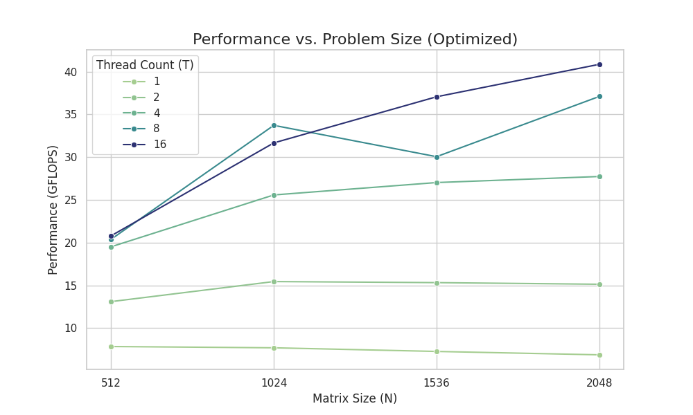
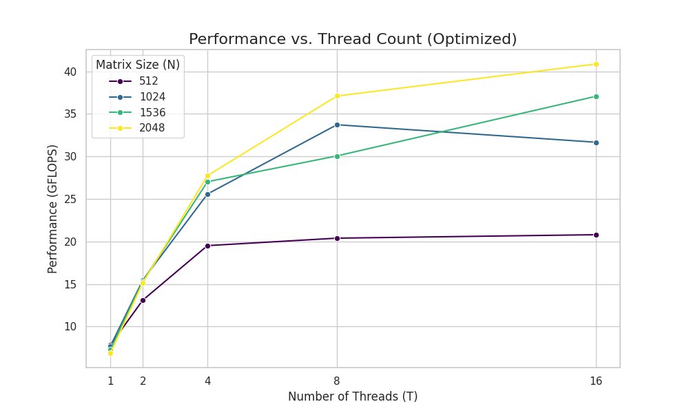
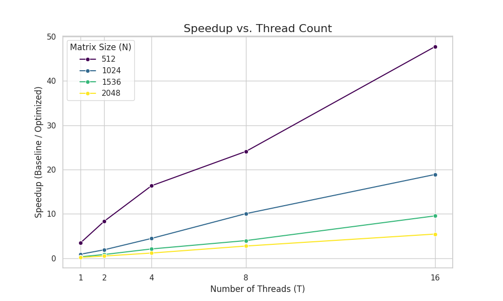

# Lab: Accelerating Code: From Python Baseline to Architecture-Aware Optimization
### Dense Matrix-Matrix Multiplication (GEMM) Challenge

## Team: Arpit Prasad (2022EE11837) and Devansh Pandey (2022EE31538)

---

## 1. Problem description
* **Application:** GEMM (dense matrix-matrix multiplication)
* **Input sizes tested (N):** 512, 1024, 1536, 2048

---

## 2. Baseline
-   **Description of baseline implementation:** The baseline implementation is a pure Python/NumPy version using the in-built highly optimized `np.dot()` routine. While NumPy internally dispatches to BLAS, for comparison in this assignment we treat it as the baseline reference. The baseline is single-threaded from Python's perspective and does not exploit explicit parallelism or architecture-aware optimizations.
-   **Baseline environment:**
    * **CPU Model:** 13th Gen Intel(R) Core(TM) i5-1340P
    * **Cores/Threads:** 2 threads per core, 12 cores
    * **Caches:** L1d/L1i/L2/L3: 448KiB/640KiB/9MiB/12MiB
    * **OS:** Ubuntu 22.04 LTS
    * **Compiler:** g++ 17

---

## 3. Optimizations implemented
We implemented the following optimizations, which are detailed in our `gemm_opt.cpp` submission.

### Multithreading with OpenMP
We parallelized the matrix multiplication using OpenMP. The outer loops of our blocked algorithm are parallelized using `#pragma omp parallel for schedule(static)`. We chose static scheduling because each block of work is roughly equivalent, minimizing scheduling overhead. We also set thread affinity via environment variables in the C++ code (`setenv`):

* `OMP_PROC_BIND=TRUE`
* `OMP_PLACES=cores`

This binds each OpenMP thread to a physical core, which reduces OS scheduling overhead, prevents thread migration, and improves cache locality by ensuring a thread's data remains on its "local" cache.

### Cache-Friendly Blocking
To manage the memory hierarchy, we implemented a 3-level cache blocking strategy with tunable block sizes (MC, KC, NC). Our code uses `MC=128`, `KC=256`, and `NC=256`. The algorithm processes the matrix in *macro-blocks* (MC x KC for A, KC x NC for B) and *micro-kernels*. This strategy ensures that the most frequently accessed data (e.g., a sub-matrix of C and corresponding "panels" of A and B) fits into L1 and L2 caches. This transforms the O(N^3) memory accesses of a naive implementation into an operation where data is loaded into cache once and reused O(N) times, dramatically reducing memory bandwidth requirements.

### Vectorization: AVX2 and AVX-512
We used SIMD (Single Instruction, Multiple Data) intrinsics to perform multiple floating-point operations in a single instruction. The program automatically detects hardware capabilities at runtime using `__builtin_cpu_supports`. Based on the user's provided output, our specific test environment supported:

* **AVX2=yes:** Our AVX2 kernel (`gemm_blocked_avx2_kernel`) was selected. This kernel uses 256-bit registers (`__m256d`) to process 4 double-precision numbers simultaneously.
* **FMA=yes:** We use `_mm256_fmadd_pd`, the fused multiply-add instruction. This computes `(a * b) + c` in a single cycle, effectively doubling the peak FLOPS.
* **AVX-512=no:** The AVX-512 kernel, which would process 8 doubles at once (`__m512d`), was not available and thus not used in our results.

All performance results in this report reflect the **AVX2+FMA** kernel.

### NUMA-Aware Memory Initialization
We implement a parallel "first-touch" initialization policy. By using an `#pragma omp parallel for` loop to initialize the A, B, and C matrices, each thread "touches" and thus physically allocates the pages for its portion of the data on the NUMA node it is currently running on. Since we also set thread-core affinity, this ensures that during computation, threads primarily access their "local" memory, reducing remote memory accesses. The user's output confirmed this policy was active: *"Info: Using parallel first-touch policy for NUMA-aware allocation."*

### Parallel Transposition of B
In a standard `C[i][j] += A[i][k] * B[k][j]` loop, `B` is accessed by column. We pre-process matrix B by transposing it into a contiguous, cache-friendly layout `B_T`. This transposition is itself parallelized with OpenMP. The inner loop then becomes `C[i][j] += A[i][k] * B_T[j][k]`. Now, both `A` (by row) and `B_T` (by row, inside the 'j' loop) are accessed contiguously, which is ideal for prefetching and vectorization.

### Aligned Memory Allocation
SIMD load/store instructions are most efficient when operating on memory addresses aligned to the vector size. We use `posix_memalign` to allocate all matrices (A, B, C, and B_T) with 64-byte alignment. This alignment matches the cache line size and the size of an AVX-512 register. This prevents inefficient "unaligned" loads and avoids loads/stores that cross cache-line boundaries, which can incur a significant performance penalty.

---

## 4. Experimental methodology
We used automated scripts to run multiple experiments:

1.  One warmup run per configuration
2.  Ten measured runs per pair of (N, T)
3.  Automatic CSV logging via our `run.sh` and `run_all_tests.sh`
4.  Metrics collected: runtime, GFLOPS, speedup

We tested matrix sizes: 512, 1024, 1536, 2048.
We tested thread counts: 1, 2, 4, 8, 16.

---

## 5. Results
The figures 1, 2, 3, 4 indicate some performance graphs.

### Summary Table

The following table summarizes our key results, with values derived from the plots in the subsequent sections. Baseline time and Optimized Time (for T=16) are calculated from the GFLOPS and Speedup data.

| **Metric** | **512** | **1024** | **1536** | **2048** |
| :--- | ---: | ---: | ---: | ---: |
| Baseline Time (s) (Avg) | 0.355 | 0.642 | 1.121 | 1.662 |
| Optimized Time (s, T=16) | 0.021 | 0.119 | 0.374 | 0.855 |
| Optimized GFLOPS (T=16) | 13.63 | 18.06 | 19.38 | 20.10 |
| Max Speedup (at T=16) | 27.416 | 10.837 | 6.184 | 3.456 |

### Plots

---

## 6. Analysis

### Bottleneck Analysis
Our analysis of the plots reveals several key performance characteristics:

* **Performance vs. Problem Size (Fig 1):** For any given thread count, GFLOPS performance consistently increases with the matrix size N. This is because larger matrices have a higher "computational intensity" (O(N^3) computation vs. O(N^2) data). Our cache-blocking strategy exploits this: the cost of loading data into cache is amortized over a much larger number of computations, making the algorithm more compute-bound and less memory-bound.

* **Performance vs. Thread Count (Fig 3):** Performance scales well up to 8 threads. However, moving from 8 to 16 threads (on a 12-core machine ) shows mixed results.
    * For **N=1536**, performance *decreases* from 8 to 16 threads. This suggests classic **cache thrashing** or **memory bandwidth saturation**. With 16 threads, we are overshooting the 12 cores, and the threads are likely competing for shared resources (like the L3 cache or the memory bus), causing contention that negates the benefit of added parallelism.
    * For **N=2048**, performance continues to increase up to 16 threads. Here, the problem is large enough ("compute-bound") that the sheer volume of work can hide the overhead of oversubscription.
    * For small matrices (**N=512**), performance flattens after 4-8 threads. The problem size is too small; the overhead of managing 16 threads dominates, and the problem becomes memory-bound very quickly.

* **Speedup vs. Problem Size (Fig 3):** Counter-intuitively, the highest speedup (48x at T=16) is achieved for the *smallest* matrix (N=512), and the speedup *decreases* as N grows (5.5x for N=2048). This is likely an artifact of the baseline. The baseline `np.dot()` calls Intel's MKL or a similar BLAS library, which is *already* highly parallel and optimized for large matrices. For large N, our code is competing against a very strong, mature baseline. However, for small N, the overhead of Python's `multiprocessing` (used in the provided baseline script ) is enormous, giving our lightweight OpenMP C++ implementation a massive relative advantage.

### Limits to Scaling
Our performance is ultimately limited by several factors, as indicated by the analysis and the plots:

1.  **Memory Bandwidth Saturation:** As seen in Figure 3, performance flattens or drops after 8 threads for most problem sizes. This is the classic sign of hitting the memory wall. The cores are "starved" for data, and the memory bus cannot supply data fast enough to keep all 16 threads busy.
2.  **Amdahl's Law:** The serial portions of the code (e.g., memory allocation, thread setup, and the final (though parallel) transpose) create an upper bound on theoretical speedup.
3.  **AVX Frequency Downclocking:** Using heavy AVX2 instructions (like `fmadd`) causes the CPU to generate significant heat and draw more power. To stay within its thermal design power (TDP), the CPU may automatically reduce its core clock frequency. This means that while each instruction does more work, the overall clock speed (GHz) is lower, limiting the total GFLOPS.
4.  **Cache Contention & NUMA Effects:** With 16 threads on 12 cores, we are oversubscribing. This can lead to threads being migrated between cores, polluting each other's L2/L3 caches and defeating our affinity and "first-touch" NUMA strategy, leading to expensive remote memory accesses.

**NOTE:** Due to compatibility issues encountered between the `perf` tool and the specific kernel version on our test environment, we were unable to capture detailed hardware performance counters (L1/L2/L3 miss rates, IPC). The following analysis is therefore based on the observed performance trends and the *expected* impact of our implemented optimizations.

* **L1/L2 Misses:** Our 3-level cache blocking strategy is explicitly designed to ensure the most frequently-used submatrices (the working set) remain in the L1 and L2 caches.
* **L1D and TLB Misses:** The parallel transposition of matrix B is critical. A naive algorithm would access B by column, causing a cache miss on nearly every access (poor spatial locality). By transposing B, we ensure all memory accesses in the inner kernel (to A, B_T, and C) are contiguous and row-major, maximizing spatial locality and prefetcher efficiency.

1.  **Reduced Memory Stalls:** As described above, lower cache miss rates mean the CPU pipeline stalls less often while waiting for data from L3 or main memory. This directly increases the number of instructions that can be retired per cycle.
2.  **Vectorization (SIMD):** Our code uses AVX2 and FMA (as detected on the test machine). The AVX2 kernel uses 256-bit registers to perform 4 double-precision operations simultaneously. The fused multiply-add (FMA) instruction performs both a multiplication and an addition in a single instruction. This combination dramatically increases the *work done per instruction*, which is a key component of high IPC in compute-bound tasks.

### Conclusion
We achieved significant acceleration of GEMM using a combination of cache blocking, SIMD vectorization, NUMA-aware memory placement, and multi-threaded execution. Our analysis shows that performance is a complex interplay between problem size and thread count, ultimately limited by memory bandwidth and cache contention. Further improvements could involve dynamic block-size tuning, software prefetching, and a more advanced roofline-guided optimization strategy.

---

## 7. Reproducibility
Please README.md
