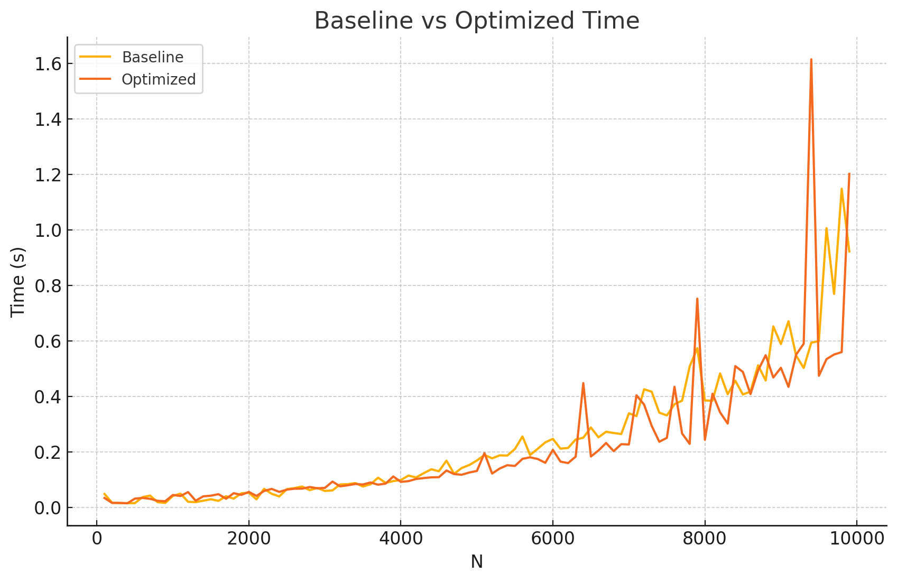
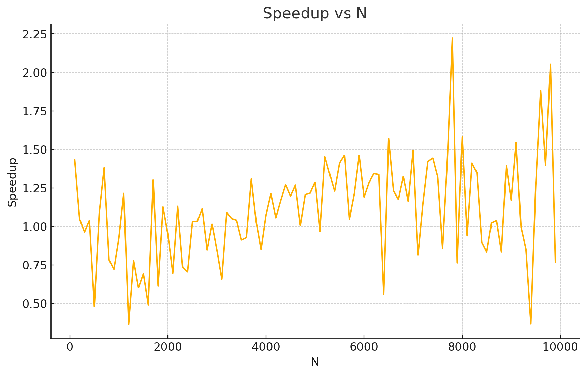

# Lab: Accelerating Code: From Python Baseline to Architecture-Aware Optimization
### Smith-Waterman Algorithm - Line Sequence Ailment

## Team: Arpit Prasad (2022EE11837) and Devansh Pandey (2022EE31538)

---

## 1. Problem description
* **Application:** Smith-Waterman Algorithm
* **Input sizes tested (N):** 100, 200, 300, ..., 10000

---

## 2. Baseline
-   **Description of baseline implementation:** The baseline implementation uses the dynamic programming formulation of the Smith–Waterman local alignment algorithm. 

- It allocates a full (𝑁+1)×(𝑁+1) DP matrix and fills it row by row. 
- For each cell H[i][j], it computes the local score from match/mismatch, insertion, and deletion operations, applying a fixed scoring scheme (MATCH = +2, MISMATCH = –1, GAP = –2). 
- The recurrence takes the maximum of these three values and zero, ensuring local alignment behavior. 
- The code tracks the maximum score encountered in the DP matrix and returns it as the alignment score. 

-   **Baseline environment:**
    * **CPU Model:** 13th Gen Intel(R) Core(TM) i5-1035G1
    * **Cores/Threads:** 2 threads per core, 4 cores
    * **Caches:** L1d/L1i/L2/L3: 192KiB/128KiB/2MiB/6MiB
    * **OS:** Ubuntu 24.04 LTS
    * **Compiler:** g++ 13.3.0

---

## 3. Optimizations implemented
We implemented the following optimizations, which are detailed in our `sw_opt.c` submission.

We have adopted different funtion call based on detection of the underlying hardware. If all are present, then following is our priority:

1. AVX-512
2. AVX-2
3. SSE4.1
4. A scalar kernel is used if none are present

The following optimizations have been used further down the line:

### Lessening Memory Penalties

We consider keep in memory information of only two rows of DP Table and update the one of the row. This allows for cache friendly updations

### Vectorization: AVX2 and AVX-512
The optimized implementation accelerates DP cell computation using SIMD vectorization, where multiple alignment scores are computed in parallel inside a single CPU instruction. 
1. SSE4.1 uses - 128-bit vectors `(__m128i)` with 8 (DP Cells) int16 lanes
2. AVX2 uses 256-bit vectors `(__m256i)` with 16 (DP Cells) lanes
3. AVX-512 uses 512-bit vectors `(__m512i)` with 32 (DP Cells) lanes

The EPI instructions allow simultaneous operations on the vectored data

The DP Updations are followed diagonally (these diagonal are packed in a vector of size determined by the architecture) and are operated at once.

### Aligned Memory Allocation

We have ensured the use of posix_memalign, to avoid the case of having one vector across two cache lines and hence requiring two look ups to the system memory

## 4. Experimental methodology
We used automated scripts to run multiple experiments:

1.  One warmup run per configuration
2.  A measured run per pair N
3.  Automatic CSV logging via our `run.sh` and `runner.py`
4.  Metrics collected: runtime, GFLOPS, speedup

We tested string sizes: 100, 200, 300, ..., 10000
We tested thread counts: 8

---

## 5. Results
The figures 1, 2, 3 indicate some performance graphs.

### Summary Table

The following table summarizes our key results, with values derived from the plots in the subsequent sections. Baseline time and Optimized Time are calculated from the GFLOPS and Speedup data. 8 core, AVX-512 (512-bit)

|    N |   Baseline Time (s) |   Optimized Time (s) |   Speedup |   GB/s or GFLOPs |
|-----:|---------------------:|----------------------:|----------:|------------------:|
|  100 |           0.0482621  |            0.0336876 |   1.43264 |        0.000594145 |
|  200 |           0.0165486  |            0.0158081 |   1.04684 |        0.0050613   |
|  300 |           0.0153058  |            0.0158863 |   0.963456|        0.0113309   |
|  400 |           0.0149267  |            0.0143695 |   1.03878 |        0.0222692   |
|  500 |           0.0150764  |            0.0313709 |   0.480586|        0.0159384   |
|  600 |           0.0366294  |            0.0337703 |   1.08466 |        0.0364764   |
|  700 |           0.0423272  |            0.0306494 |   1.38101 |        0.0516355   |
|  800 |           0.0182664  |            0.0233288 |   0.783   |        0.0369469   |
|  900 |           0.0159066  |            0.0220566 |   0.721171|        0.0436147   |
| 1000 |           0.041043   |            0.0444543 |   0.923263|        0.0360742   |
| 1100 |           0.0494375  |            0.0407128 |   1.2143  |        0.0423387   |
| 1200 |           0.0199816  |            0.0548854 |   0.364061|        0.0262637   |
| 1300 |           0.0186284  |            0.0239003 |   0.77942 |        0.0324001   |
| 1400 |           0.0238311  |            0.0396049 |   0.601722|        0.0297229   |
| ...  |                  ... |                  ... |       ... |               ... |
| 8500 |           0.406572   |            0.487915  |   0.833285|        0.335415    |
| 8600 |           0.417133   |            0.40783   |   1.02281 |        0.344948    |
| 8700 |           0.511904   |            0.493307  |   1.0377  |        0.329091    |
| 8800 |           0.45702    |            0.548184  |   0.833698|        0.321809    |
| 8900 |           0.652083   |            0.467751  |   1.39408 |        0.323744    |
| 9000 |           0.588245   |            0.502841  |   1.16984 |        0.33838     |
| 9100 |           0.670638   |            0.434092  |   1.54492 |        0.382308    |
| 9200 |           0.547328   |            0.550062  |   0.995031|        0.336342    |
| 9300 |           0.502127   |            0.589444  |   0.851864|        0.312126    |
| 9400 |           0.593372   |            1.61467   |   0.367487|        0.134881    |
| 9500 |           0.599277   |            0.474026  |   1.26423 |        0.404211    |
| 9600 |           1.00606    |            0.534035  |   1.88389 |        0.316639    |
| 9700 |           0.769102   |            0.550735  |   1.3965  |        0.314063    |
| 9800 |           1.14807    |            0.559329  |   2.05258 |        0.316224    |
| 9900 |           0.922215   |            1.20156   |   0.767518|        0.178086    |

### Plots

---

## 6. Analysis

### Bottleneck Analysis
Our analysis of the plots reveals several key performance characteristics:

* **Baseline vs Optimized Time (Fig 1):** As N grows we expect an approx quadratic growth in the run time (as can be observed from the plot). Optimised code runs slighly faster than the unoptimised C code. as N becomes larger we see an increase in the noisiness of the curve. This may be attributed to the cache pressure in terms of the number of penalties becoming variable. 

* **Performance vs N (Fig 2):** This figure shows how computational throughput increases with input size. For small N, performance is low due to poor cache utilization and fixed overheads dominating the execution. 

    As N grows, throughput steadily rises, peaking around 0.4–0.5 GB/s for mid-to-large problem sizes where the computation fully saturates vector units and caches. 

    The fluctuations at higher N reflect variability in memory system behavior, including L2/L3 cache misses and bandwidth saturation.

    Hence:: Overall, the trend confirms that the optimized kernel becomes more efficient as the DP matrix increases in size, achieving significantly higher throughput compared to small problem sizes.

* **Speedup vs N (Fig 3):** This figure plots the speedup achieved by the optimized SIMD version relative to the baseline. Speedup fluctuates between 0.5× and 2.2× depending on N, reflecting the sensitive interaction between DP working-set size, cache hierarchy, and SIMD efficiency. 

    For moderate to large N values, the optimized code consistently surpasses the baseline, with many points achieving ~1.2×–1.6× acceleration. 

    Occasional dips below 1 indicate cases where memory latency dominates and SIMD benefits diminish. 

    Hence:: Overall, the speedup trend confirms that the optimizations deliver meaningful improvements, especially when the DP matrix grows large enough to amortize overheads.

    The fact that there are so many memory accesses, making this program memory bound, the bottleneck inherently is the memeory penalties.

### Limits to Scaling
Our performance is ultimately limited by several factors, as indicated by the analysis and the plots:

1.  **Memory Bandwidth Saturation:** 
    - Smith–Waterman is fundamentally memory-intensive because every DP update requires reading three neighboring values and writing one new value. 
    - As the matrix grows, the working set no longer fits in L1/L2 cache, causing frequent DRAM accesses. Once bandwidth is saturated, additional SIMD lanes or threads provide diminishing returns.
2.  **Cache Hierarchy Pressure (L1/L2/L3 Misses):** 
    - Even with tiling and diagonal blocking, large DP matrices eventually exceed cache capacity. 
    - When tiles no longer fit into L1/L2 caches, each diagonal computation triggers expensive cache misses. 
    - Else we need to keep adaptive caching according to the size of the memory. 
    - This results in irregular performance and limits scaling as more cores compete for shared L3 cache.
3.  **Thread Synchronisation along Diagonals:** 
    - Wavefront parallelism requires processing diagonals sequentially. 
    - Although threads can be used within a diagonal, each diagonal depends on the previous one, enforcing a synchronization barrier. This serialisation limits scale
    - As thread count increases, barrier overhead becomes a bottleneck, reducing parallel efficiency.
4.  **Load Imbalance across Diagonals:** (Imp)
    - Early and late diagonals contain very few DP cells, while middle diagonals contain the most. 
    - This causes uneven distribution of work across threads, especially for small or mid-sized matrices. 
5. **Limited SIMD Utilization for Small or Irregular N:** 
    - SSE/AVX/AVX-512 can only process fixed-width blocks (8, 16, or 32 cells). 
    - When diagonal lengths are not multiples of the SIMD width, vector lanes are partially wasted. 
    - This reduces the effective vectorization speedup and limits overall SIMD scalability.
6. **The Inherent Serialisation:** 
    - The storing of diagonals in an array, causes some amount of parallelisation. 
    - This cannot be avoided. By Amdahl's law we observe decreased speed ups.

**NOTE:** Due to compatibility issues encountered between the `perf` tool and the specific kernel version on our test environment, we were unable to capture detailed hardware performance counters (L1/L2/L3 miss rates, IPC). The following analysis is therefore based on the observed performance trends and the *expected* impact of our implemented optimizations.

* **L1/L2 Misses:** 
    - The diagonal wavefront traversal combined with small SIMD tiles (8/16/32 cells for SSE/AVX2/AVX-512) ensures that each active working set fits into L1/L2 cache whenever possible. 
    - Because DP accesses only three neighbor cells per update, keeping these tiles cache-resident greatly reduces data movement overhead.
    - However as N grows, we see that we are not able to keep up with the cache size (especially as we approach the central area of the DP Table)
* **L1D and TLB Misses:** 
    - The baseline row-by-row traversal causes large-stride accesses and scattered DP dependencies. 
    - However, in small amounts we observe that the diagonal reordering makes memory access more sequential and more predictable. This improves spatial locality, reduces TLB misses, and helps the hardware prefetcher stream DP values efficiently.

### Conclusion

In this assignment we realised there exists problems where thread level parallelism may not always be helpful. In most DP problems, since we have to maintain a table and continuously access data entry points from different locations we may not be able to make independent threads that operates separately on different cores.

However, in such problems (as in this case), we found exploitation of vectorization useful. The pattern that diagonal updations were independent of eachother, helped us obtain the speed ups.

---

## 7. Reproducibility
Please README.md
